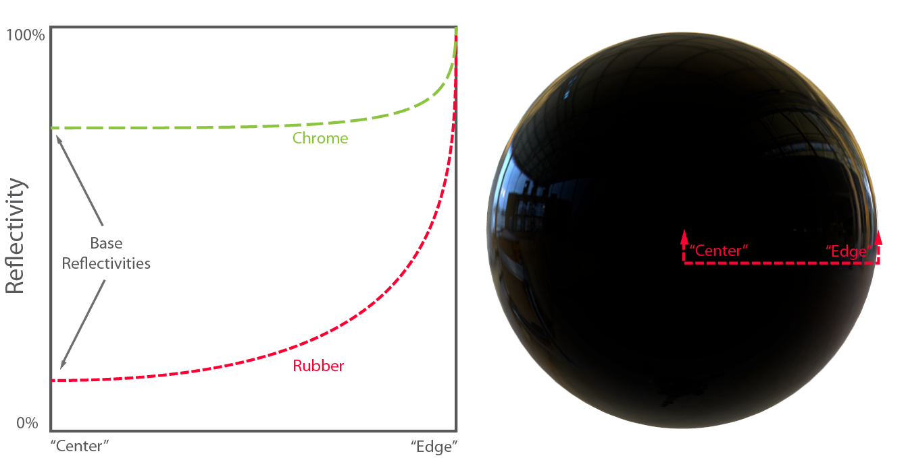
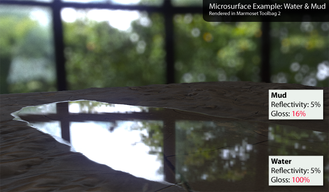

#基于物理渲染的基础理论（译）

**2016-4-23**

原文链接：[http://www.marmoset.co/toolbag/learn/pbr-theory](http://www.marmoset.co/toolbag/learn/pbr-theory)

近来，基于物理的渲染（PBR）是一项令人激动的实时渲染的趋势。这个术语包含了很多内容，通常会让人产生困惑，以至于不明白它到底是什么。因此我将使用试图解释下，什么是基于物理的渲染，以及它和以往的渲染方式的区别。这篇文档主要是给非技术工程师的，并且文中不会有任何数学和代码。

基于物理的渲染系统不同于以往的渲染系统，大部分更细节的原因是关于光和表面的行为。着色能力有了很大的进步，一些老旧的近似模拟的效果和制作方法可以抛弃了。这就意味着技术工程师和艺术家都应该清楚的理解这些变化。

在讲解基于物理的渲染的新内容之前，我们会从一些基础的内容开始讲起。如果你已经知道下面要讲的内容了，你应该会认为这是非常值得阅读的。或许你可以去看看 Joe Wilson 的名为 [creating PBR artwork](http://www.marmoset.co/toolbag/learn/pbr-practice) 的文章。

###散射（Diffusion）和反射（Reflection）

散射（Diffusion）和反射（Reflection），就是我们平时所说的漫反射（diffuse）和镜面反射（specular），这是描述光和表面交互的最基本的区别的两个术语。大多数人在现实情况中对这些概念很熟悉，但是也许并不知道其中的物理区别。

当光线到达表面边界时，一部分会被反射（反弹）出去，方向是在法线的另一边的相反的方向。这个行为非常类似于朝着地面或者墙扔出一个球，球会以一个相反的角度反射出去。在一个平滑的表面上，就会表现为像一个镜面一样。镜面反射（specular）这个词通常用来描述这个效果。

然而并不是所有的光线都会被反射出去。通常一部分光线会穿到被照亮的表面的内部去。这部分光线可能被材质所吸收，或者在内部散射开。一部分散射开的光线会再次回到表面，射入眼睛或相机。这个过程有很多个名字：漫反射（Diffuse Light）、散射（Diffusion）、子表面散射（Subsurface Scattering），所有这些名词说的是同一个事情。

吸收和散射光线对于不同波长的光线是有很大区别的，取决于是什么让物体着色（比如一个物体吸收了大部分颜色，但是散射蓝色，那物体就表现为蓝色）。散射通常都是很均匀且杂乱的，可以说是从所有方向上都是一样的，这和镜面有很大的不同。Shader 使用一个名为 Albedo 的输入来近似模拟，Albedo 是一个颜色值，它描述了光线的各种颜色散射出表面的百分比。有时候也用 Diffuse color 这个词来表示，它和 Albedo 是一个意思。

###半透明（Translucency）和透明（Transparency）

在一些情况下，反射会变得更为复杂，比如像皮肤、蜡这一类的材质，在材质内部光线有着很大散射距离。这时单一的颜色就无法表现了，着色系统必须考虑到物体的形状和厚度。如果物体足够的薄，通常会看到光线从背面散射出来，这被称为半透明。如果几乎没有散射（比如玻璃），所有的光线完全穿过了物体，这就是透明。这些行为和普通的近表面反射有着很大的不同，需要特殊的着色器来模拟。

###能量守恒（Energy Conservation）

通过以上这些描述，我们有足够的信息得出以下的结论，散射和反射是相互独立的。因为，为了让光线被散射，光线必须先进入表面，这就意味着没有了反射。这就是“能量守恒”这个说法的一个例子，也就是说离开表面的光线不会比落在表面的光线更亮。

这点非常容易在着色系统是实现：在漫反射着色之前，简单的减去被反射的光线。这就意味着高反射率的物体看上去没有了散射光，因为没有光线进入物体表面，几乎都被反射掉了。反过来也是正确的：一个有着更多散射的材质，就无法有很多的反射。

这种能量守恒是基于物理渲染的重要的部分。这可以让艺术家在符合物理定律的基础上调整散射和折射值。然而一个好的艺术效果并不是必须在代码中强制加上这些限制，只是作为一个参考物理概念（nanny physicist），以确保不会偏离规则太远或者在不同的光照条件下变得不一致。

###金属（Metals）

导电的材质，尤其是金属，因为一些原因值得特别的提及一下。

首先，导体通常比绝缘体有更多的反射。导体通常表现出高达 60% ~ 90% 的反射率，而绝缘体比较低，在 0% ~ 20% 之间。这种高反射率阻止了大多数光线进入物体内部进行散射，让金属看起来非常的亮。

第二，导体的反射在可见光的光谱上回呈现出很大的差异，也就是说反射会呈现出色彩。这种色彩反射在导体中也是不多见的，但是它就发生在我们日常会接触到的材质上，比如黄金，铜，黄铜。绝缘体通常不会有这个现象，它们的反射不会呈现出色彩。

最后，导体通常会吸收而不是散射进入内部的光线。也就是说在导体理论中不会有任何的散射光线。现实中，往往有一些氧化物或者残留物在金属的表面，这些东西会散射少量的光线。

正是这种介于金属和其他物质之间的材质导致一些渲染系统采用“金属度”作为一个直接的输入参数。在这种系统下，艺术家可以指定材质表现为金属的程度，而不是仅仅明确的指定反射率和散射率。有时会更倾向于使用更简单含义来创建材质，但这并不是基于物理渲染的必须的特征。

###菲涅尔（Fresnel）

Augustin-Jean Fresnel 似乎是一个我们无法忘记的已经去世的白人，主要是用他的名字表述了一系列的现象，他是第一个对这类现象做到精确描述的人。在他之前，很难去讨论光的反射。

在计算机图形学中，Fresnel 是指出现在不同角度上的不同的反射率。明确的说，比起光线正中表面，当光线以一个擦着物体表面的角度(Grazing Angles)射到物体上时更像是一种反射。这就意味着呈现了合适的 Fresnel 效果的物体，在边缘将有更明亮的反射。我们大多数人其实已经对此很熟悉了，并且这在计算机图形学中也不是新的概念了。然而基于物理的渲染着色器对 Fresnel 方程的评估进行了一些重要的修正。

首先，对于所有的材质，在 Grazing Agnels 有着完全的反射率，观察一个平滑物体的边缘，应该是一个完美的镜面，不管是什么材质。也确实是这样的，任何一种物质当以一个正确的角度去看时都可以作为一个完美的镜面！这也许有点违反直觉，但是物理上就是这样的。

其次，不同材质的 Fresnel 属性随着角度变化的曲线并不是有很大的差别。金属之间是差别最大的，但是也可以被解释分析。

这对我们意味着，加入想要增加真实感，艺术家通常应该减小 Fresnel 现象的差异，而不是扩大这种差异。至少，我们知道了如何设置默认值。

这是一个好消息，因为可以简化内容的生成。着色系统可以完全自己来处理 Fresnel 效果。只需要使用一些已经存在的材质属性，就像是光泽（Gloss）和反射率（Reflectivity）。

基于物理的渲染的工作流有一个艺术家指定的某种“基础反射”值。这个值提供了光线反射的最小数量和颜色。Fresnel 效果，一旦渲染，将会在艺术家指定的反射率上再进行叠加，在斜观察表面角度（Glancing Angles）时会达到100%。这个值是一个基础值，Fresnel 等式会接管这个值，使得表面在许多角度时根据需要产生更多的反射。

对于 Fresnel 效果有一个提示，当表面变得平滑的时候，Fresnel 效果会迅速的变得难以观察到。

###微表面（Microsurface）

上面描述的反射和散射都依赖于表面的朝向。放大来看，这被用来渲染网格的形状，也可以使用法线贴图来描述更小的细节。这样任何渲染系统都可以处理更多的细节，把反射和散射表现得更好。

然而，任然有一点没有考虑到。大多数真实世界的表面都存在非常小的缺口：凹槽、裂缝、凸块，这些都因为太小了以至于眼睛无法看到，并且使用正常解析度的法线贴图都无法表现出来。尽管无法被肉眼看到，但这些微粒还是影响着反射和折射。

为表面细节最容易在反射中被观察到（散射并不会被太多的影响到，这里不会讨论到）。上图中，入射光的平行线当从粗糙的表面反射是发生了交叉，因为每一条射线遇到的表面方向都不一样。就像将球抛向墙面一样，如果墙面非常不平整，球任然会反弹，但是反弹方向是不可预测的。简而言之，表面越粗糙，越多的反射光线会产生交叉，看上去越“模糊”。

不幸的是，为了着色而评估每一个微表面特征对美术、内存、计算量来说都是非常昂贵的操作。我们该怎么做呢？事实证明，如果我们放弃直接描述微表面，取而代之使用整体的粗糙度，就可以写出相当精确的着色器来产生类似的效果。这个值通常指的是光泽度（Gloss），平滑度（Smoothness）或者粗糙度（Roughness）。可以从纹理或者一个常量值中获取。

这种微表面细节对于任何材质来说都是非常重要的，因为真实世界到处都是各种各样的微表面特征。光泽贴图并不是一个新的盖面，但是它在基于物理的渲染中起到了关键的作用，因为微表面细节对光反射有着很大的影响。就如我们一会儿会看到的，有几个关于微表面属性基于物理渲染改善的注意事项。

###再谈能量守恒（Energy Conservation）

就如我们假想的着色系统，考虑到了微表面细、合适的反射光延展，我们也必须考虑到反射正确数量的光线。遗憾的是，旧的渲染系统在这一点上都是错误的，根据微表面的粗糙度反射了太多或者太少的光线。

当方程达到一个正确的平衡时，渲染系统应该显示粗糙的表面为大范围的昏暗的高亮。所有的材质都反射相同数量的光线，粗糙的表面将光散射到不同的方向上，而平滑的表面反射为更集中的光线。

这是能量守恒必须做到的第二个特征。这是任何基于物理的渲染系统必须做到的要点之一。

###迎接微表面（All Hail Microsurface）

基于以上的知识，我们认识到一个事实，微表面的光泽度直接影响到表面反射的亮度。这就意味着艺术家可以直接在光泽度贴图上绘制各种差异，划痕、刮擦等，	基于物理的渲染不仅会改变反射方向而且会影响相对强度。不再需要类似于反射率遮罩图了。

这是很重要的，因为真实世界的两个在物理上相关度量值（微表面细节和反射率）第一次在艺术上和渲染处理上被正确的联系在了一起。这与之前描述的反射和散射的平衡很像，我们可以让两个值相互独立，但是由于它们是有联系的，企图分别对待它们只会变得更困难。

通过观察真实世界材质，反射率值不会不会相差太大。比如说水和淤泥，它们的反射率是类似的，但是由于淤泥表面相当的粗糙，而水表面相当的平滑，所以它们在反射率上看上去会相差很大。艺术家创建下面的这个基于物理渲染的场景时主要会创建不同的粗糙或者平滑的控制纹理，而不是调整反射率参数。

此外微表面属性在反射上还有其他的细微效果。例如边缘变量的 Fresnel 效果在粗糙的表面上会变得不明显（这是由粗糙表面更多的散射造成的）。凹的微表面会“困住”光线，导致光线会在微表面之间多次反射，多次进入描边内部，被更多的吸收，更多的散射，亮度变暗。不同的渲染系统在处理这些细节上会使用不同的方法，但是粗糙的表面会显得更昏暗上是趋于一致的。

###总结

当然还有很多关于基于物理的渲染可说的，这篇文章只是一些基础的介绍。想要了解更多的相关技术，推荐几篇阅读：

* John Hable’s excellent blog post:[Everything Is Shiny](http://filmicgames.com/archives/547)
* John Hable’s even better blog post:[Everything Has Fresnel](http://filmicgames.com/archives/557)
* Sébastien Lagarde’s summary of [Rendering Remember Me](http://www.fxguide.com/featured/game-environments-parta-remember-me-rendering/)
* Come to think of it, all of [Sébastien Lagarde’s Blog](http://seblagarde.wordpress.com/) is good stuff
* The [SIGGRAPH 2010 course](http://renderwonk.com/publications/s2010-shading-course/) on PBR
* Always worth mentioning: [The Importance of Being Linear](http://http.developer.nvidia.com/GPUGems3/gpugems3_ch24.html)