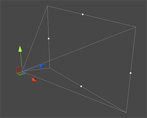
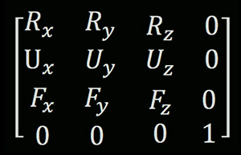
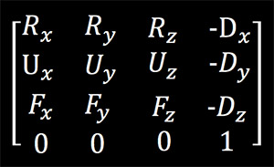

#相机空间矩阵

**2016-4-4**

相机空间矩阵的作用是将模型从世界空间变换到相机空间，对应 Unity 提供出来的接口是 `camera.worldToCameraMatrix` 以及 `UNITY_MATRIX_V`。这个矩阵 Unity 引擎已经为我们构造好了，所以不需要自己去创建，直接调用即可。但是还是要学习下其构造的方法，主要原因是如果想要完成一些特殊的效果还是需要理解其中的原理。

我们将一个坐标系下的点或者向量转换到另一个坐标系下，并不会改变这个点或者向量本身的位置以及朝向，只是描述这个点或者向量的参考坐标系发生了变化。 相机本身是在世界空间下的，所以它的位置和旋转角度都是世界坐标中的值。很多参考资料上会把世界空间变换到相机空间描述成，把相机移动到世界坐标的原点，然后把相机的朝向转向世界 z 轴的负（OpenGL）方向，对应的世界空间中的所有模型也都进行一遍相机的相对位移和相对旋转角度，这样相对相机来说，整个世界没有任何变化。这样解释其实还是很形象的，有时我还会把这个过程想成另一种方式，其实这个过程中没有任何一样东西发生了位移和旋转，相机和模型还是在原来的位置和角度（世界空间中）上，只是经过相机空间的变换后，模型的位置和角度变成了相机空间中的值，就比如在 Unity 的 Hierarchy 中，将节点 B 拖动到节点 A 下，这时 B 就是 A 的子节点了，如果节点 B 是一个 Cube，会发现其实这个 Cube 的位置在 Scene 窗口中并没有发生变化，但是它的 localtransform 改变了。这其实和把模型从世界空间变换到相机空间是一个道理。

关键是这个变换矩阵从何而来，简单来说可以直接从相机在世界空间里的三根正交轴得到。假设这三根轴分别是 R(右) U(上) F(前)，那么相机空间矩阵就应该是这样的。

变换到相机空间一般只有位移和旋转，很少用到缩放，所以下面把位移加上就可以了。

还有最后一点需要注意的是，由于 OpenGL 最终都会把相机空间朝向调整到 Z 轴的负方向，所以 Z 都会乘以 -1。到此为止，我们计算得到的矩阵就和 Unity 引擎给出的矩阵就一致了。第四列的位移很好理解，左上 3x3 的矩阵是三个单位向量，理解这三个单位向量怎么就可以组成这个矩阵还有另一种方式，考虑下[向量的投影](VectorProjection.html)，其实就是把要转换的坐标位移后分别投影到这三个单位向量上，分别得到的三个投影长度值就是相机空间的位置了。

这样理解还有另一个好处，比如在做 Billboard 的时候，一般的做法是直接在应用程序中修改 transform，但是这样造成的问题是 Billboard 没有办法使用 Unity 的静态合并，所以就需要在 Shader 中实现。如果每帧都在代码中使用 `setUniform` 将相机的轴向传送给 Shader，一旦有很多Billboard，也是一笔不小的开销。而现在不需要了，因为 Unity 已经在 Shader 中为我们设置好了相机空间矩阵，拿到这个矩阵后直接取出前三行就是相机的三个轴向了，直接沿着想要的轴向偏移顶点坐标即可。

