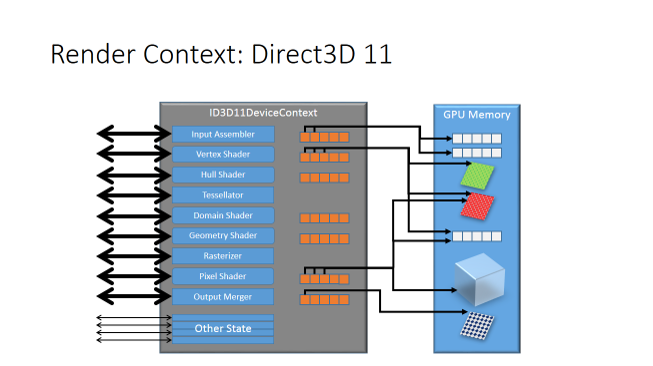
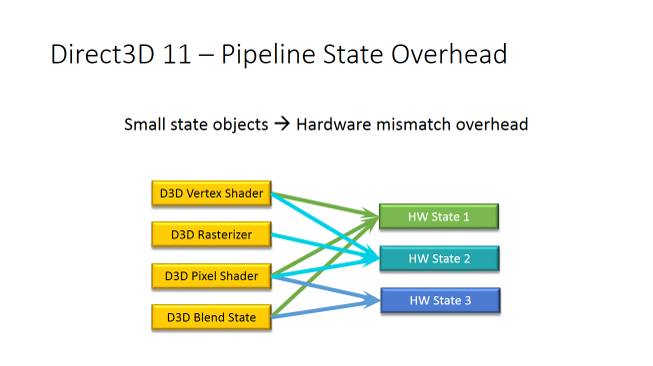
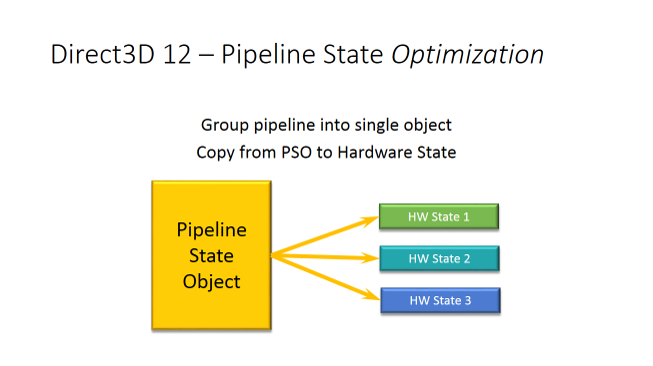

#Direct3D 12 Note Part 7

**2016-2-2**

##Pipeline State Object

上图中我们只看左边半部分，每一个箭头都指向了一个独立的管线状态，每一个状态都可以根据程序的需要进行设置或获取。下面的 Other State 是由固定功能状态组成，比如视口、裁切矩形。Direct3D 11 的 Small State Objects 相较于 Direct3D 9 已经减少了一部分的 CPU 开销，但是驱动任然需要在运行时把这些 Small State Objects 转换成 GPU 代码。我们把这种消耗叫做 Hardware Mismatch Overhead。如下图。

一般来说，驱动不会立刻将应用程序设置的状态进行编码，而是在真正开始渲染前进行编码。这就需要将所有设置的状态记录下来，并对某些状态标记为 Dirty，这就需要做很多额外的工作。下图展示了 Direct3D 12 的优化。

Direct3D 12 将多个管线状态组合到一个 PSO 中。并且当换 Render Target 时不需要重新编译 PSO。所以最终将管线状态分为了 PSO 和 Non-PSO。

这样就基本避免了 Hardware Mismatch Overhead 的开销，只需要将预编译好的 PSO 对应的 GPU 指令直接传送到 GPU 即可。