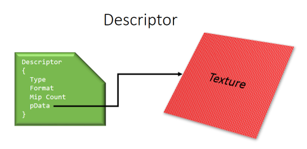
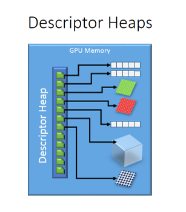
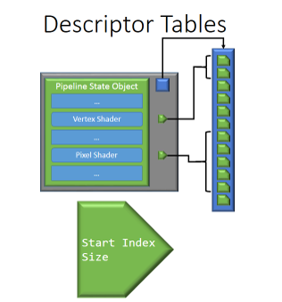
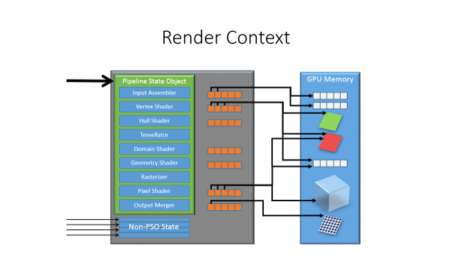
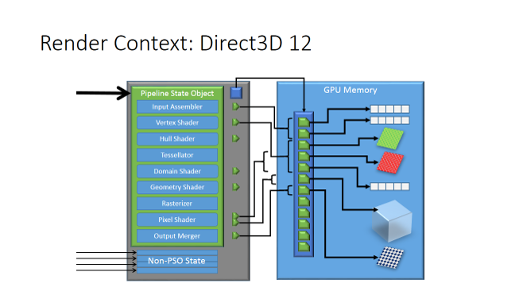

#Direct3D 12 Note Part 8

**2016-2-2**

##冗余的资源绑定

在分析了多个游戏后，我们发现，通常游戏在这一帧和下一帧都会使用相同的一串绘图指令。不仅仅是指令，对比两帧中进行的绑定操作也是基本相同的。所以如果可以将这些绑定操作缓存起来将会得到很大的性能提升。

当让，不能简单的将一连串的绑定操作直接缓存起来，因为其中可能有一两步绑定操作在下一帧中会发生变化，造成上一帧的缓存没有用了。那么如何解决这个问题呢，下面会逐步说明。

###描述符（Descriptor）

什么事 Descriptor ？Descriptor 定义了各种参数来描述一种资源。

比如上图中，Texture 的 Descriptor 定义了纹理的几个参数。

###堆（Heaps）

Heaps 是由很多个 Descriptor 组成的大型数组（如上图）。在 Direct3D 11 中，你无法复用 Descriptor，只能创建一个新的或者完全复制一个 Descriptor。现在通过 Heaps 就能做到对 Descriptor 的复用。Heaps 中的 Descriptor 的顺序完全是由应用程序控制的。Heap 的尺寸大小根据 GPU 的架构会有所区别，越低端的 GPU 所能容纳的 Heap 尺寸越小，所以 Direct3D 12 允许在多个 Heap 之间进行切换。但是在某些 GPU 上切换 Heap 会导致一次刷新（Flush），所以最好减少这么做的次数。

###表（Tables）

Tables 记录了 Heaps 中的一个起始点和一个尺寸（如上图）。现代的硬件，Direct3D 12 可以让 PSO 中的每一个 Shader 阶段都有多个 Tables。比如你可以同一个 Tables 来记录经常发生变化的操作，另一个 Tables 记录不变的操作。 

###减少资源绑定，提高效率

Direct3D 11

Direct3D 12

