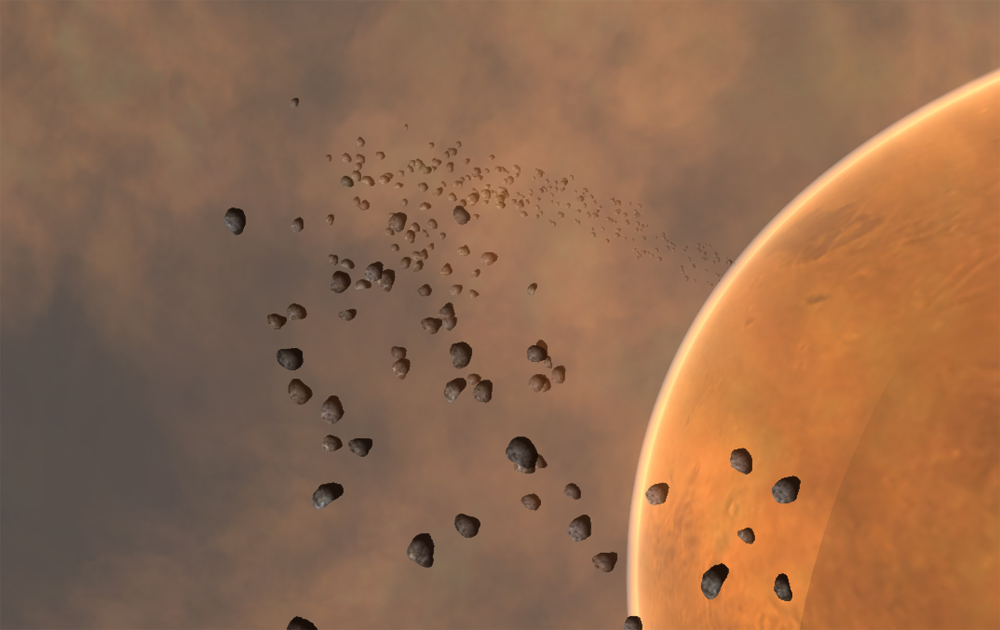

#绘制大量动态物体

**2016-2-26**

如果需要在场景中绘制很多的相似动态物体，那么一般情况下，每个动态物体都会占用一个 DrawCall。为什么说是一般情况，因为在 Metal、Direct3D11、GLES3 都有对应的方案能够减少这部分的 DrawCall 消耗。但是目前大部分的移动设备还都是 GLES2，那么这种情况下 DrawCall 就是需要面对的最大问题。

在 Unity 编辑器场景中放置很 10 个简单面片，并且这些面片都使用了同一个材质球，会发现 DrawCall 可能会是 1，而不是 10。这是由于 Unity 的动态合并造成的。动态合并是 Unity 引擎内部进行的一种优化动态物体的 DrawCall 的方法。动态合并虽然对开发者来说是透明的，可是动态合并是需要付出一定代价的，如果使用不当，这种代价可能会很大，并且很难被追踪到。所以我们应该对场景中那些物体触发了动态合并了如指掌，能不使用就不要使用。

下面这张图展示了我们需要绘制的场景，有大量的小行星需要绘制，每个小行星的速度、自转、公转、尺寸都是不同的。

比如，现在需要绘制 200 个这样小行星，并且要让 DrawCall 竟可能的少。

一般的做法就是每个小行星都是一个模型，创建很多个小行星实例，不断的调整其尺寸、位置。这时，如果触发了 Unity 的动态合并，那么 DrawCall 会大大小于 200，如果没有触发动态合并，那么 DrawCall 是 200。不幸的是动态合并对模型材质等等存在着诸多限制，并且也不是免费的午餐。

下面要介绍另一种实现方式，这种方式可以让 DrawCall 降低到最小，甚至是 1 个 DrawCall，但是缺点是会带来内存上的一定增长。

我们先想一下，原来的实现方式导致 DrawCall 高的原因是，把每个小行星当做单独的个体（模型），那么如果我们把所有的小行星合并成一个整体（模型），是不是就只有一个 DrawCall了呢（一个物体当然只有一个 DrawCall）。那么问题来了，公转、自转、速度、尺寸，这些参数每个小行星的数值都不一样，一旦进行了合并，普通的做法就无法让每个小行星有各自的行为了，所以就需要有一些特殊的做法。下面就来介绍下这个特殊的做法。

首先需要将每个小行星特有的公转、自转、速度、尺寸这些参数存储到 Mesh 中，至于存储到 Mesh 的哪个属性中就看需要了，可以放到 color 中，也可以放到 tangent 中，这些属性本来是用来表示其他意思的，但现在借用来表示其他意思。一旦设置好这些参数后，就可以在 Shader 中获取到具体的数值，再用这些具体的数值参与到位置、颜色的运算中，这样就可以了。上图中的效果就是使用这种方法完成的，DrawCall 只有 1。

当然还可以再优化，就是每个小行星可以是 Billboard，而不必是模型，这样占用的内存会和渲染面数的压力会大大减小，效果也可以达到要求。