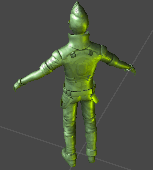

# 使用 LUT 模拟光照

**2016-7-8**

一般要得到比较好的光照效果，就要在 fragment shader 中进行计算，并且很多时候要同时模拟多盏灯的光照才能得到比较满意的效果，再加上高光计算，fragment shader 中的指令数量会变得越来越多，计算量也随之增大。最近在网上看到一种非常巧妙的模拟光照的方法，使用一张 Lookup Table 来表示光照信息，使用相机空间中的法线作为 uv 采样 Lookup Table 中的像素数据，作为光照。

> 
> 
> 这是使用这种方式实现的伪光照效果。

从图中可以明显的看出，环境光为绿色，左上方有一个白色的点光，右下方有一个黄色的点光。物体在两个点光源照射下都会产生高光效果，物体材质本身又有少许的环境反射。这些效果都是可以通过 Lookup Table 进行直观的控制。如果使用常规的方法实现，至少会有两个 pow （两个点光的高光）以及一个 cubemap 的采样（还有其它各种计算），而现在只需要一次二维纹理的采样即可。

> 
> 
> 这是上面效果图所使用的 Lookup Table。

从 Lookup Table 这张纹理中，很容易看出上文所描述的光照效果。或许你会觉得这张 Lookup Table 很像一个材质球，其实这就是 Unity 中材质球的截图，所以制作这张 Lookup Table 的方法也是非常简单的。下面我们来分析下着色器代码，就能清楚其中的原理，并且知道为什么 Lookup Table 会是这样的了。

	// vertex shader
	v2f o;
	o.vertex = mul(UNITY_MATRIX_MVP, v.vertex);
	o.uv = TRANSFORM_TEX(v.uv, _MainTex);

	half2 light_uv = half2(0, 0);
	// 将 normal 变换到相机空间
	light_uv.x = dot(UNITY_MATRIX_IT_MV[0].xyz,v.normal);
	light_uv.y = dot(UNITY_MATRIX_IT_MV[1].xyz,v.normal);
	light_uv *= 0.95;
	o.lut = light_uv * 0.5 + 0.5;

关于变换法线向量时的注意点请看 [NormalTransformation](NormalTransformation.html)。由于这里我们采样 Lookup Table 时只需要 uv 连个值即可，所以只需要法线变换到相机空间后对应的 xy 值即可(light_uv.xy)。相机空间中，light_uv.xy 的范围是从 －1 到 1，所以需要将其映射到 0 到 1 的范围内。而在此之前我将 light_uv 乘以了 0.95，是为了采样 Lookup Table 纹理时，如果是非点过滤模式，有可能会把圆范围以外的值混合进来，造成显示上的瑕疵。

	// fragment shader
	fixed4 col = tex2D(_MainTex, i.uv);
	fixed4 lut = tex2D(_LookupTable, i.lut);
	return col * lut * 2;
	
像素着色器的代码就相当简单了，直接叠加材质的固有色和伪光照信息即可。

这种模拟光照的方式自由度非常高，你可以模拟出任意多盏像素光照，而且质量都不低。还有一种应用，比如角色从一种环境氛围中走到另一种环境氛围中，就可以预先准备两张环境氛围的 Lookup Table，在这两张 LookupTabel 中做融合。