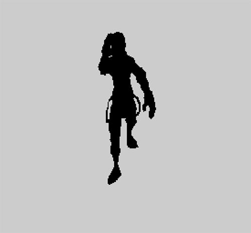
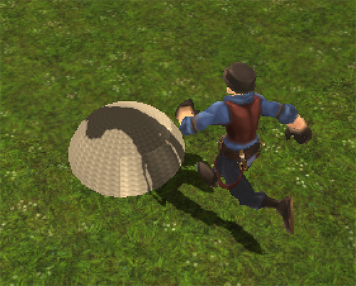
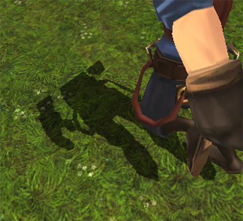
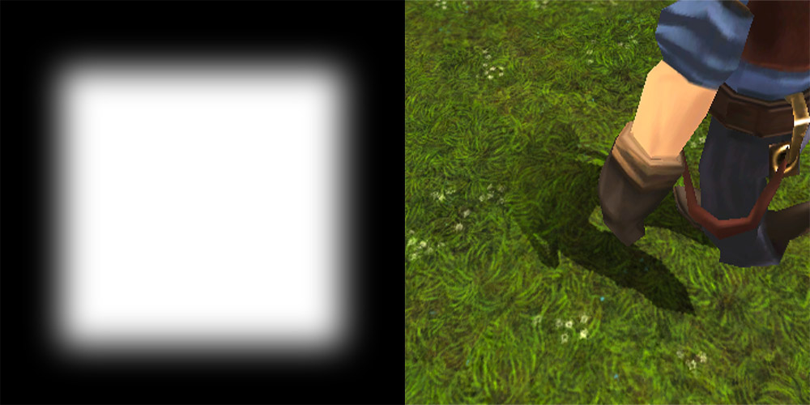
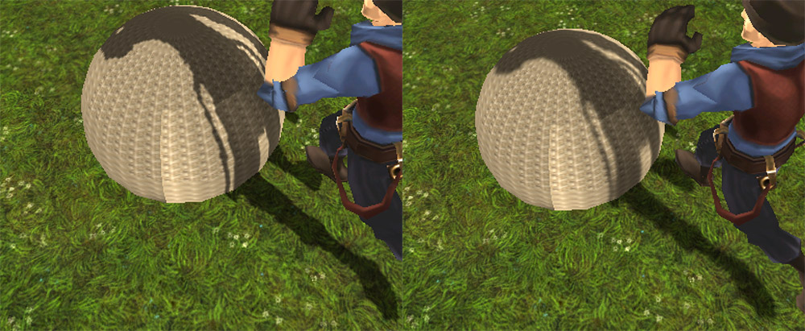
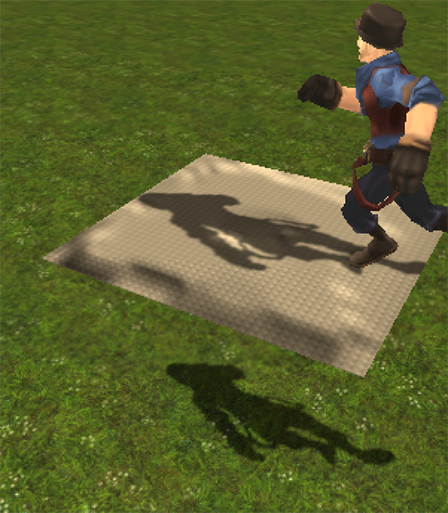

#移动设备渲染实时阴影

**2016-4-2**

Unity 内置了实时阴影的功能，可以对动态物体产生实时阴影，增加物体的体积感，同时还能很好的和 Lightmap 共存，效果还是可以的。但是在移动设备上往往会占用很多本来就不多的资源。Unity 使用的是 Cascaded Shadow Map，这种技术最基本的原理就是 Shadow Map。要使用 Shadow Map，首先就得有一张 Map，这张 Map 可以理解为一张纹理，里面记录的是在光源位置看到的场景的 Depth Buffer，为了渲染这张 Depth Buffer，就需要多渲染一遍场景。在拿到这张 Depth Buffer 后，还需要在真正渲染物体的时候，将顶点坐标转换到相对于光源的深度值，对 Depth Buffer进行采样，对比两个深度值得大小。如果是 Cascaded Shadow Map，除了上面的步骤，还需要使用算法对相机视锥体进行切割，根据远近关系分别渲染不同的 Depth Buffer。这就是简单的原理描述，真正实现起来可没那么简单，还需要处理各种细节和显示异常。具体的细节可以参考[^1]-[^2]-[^3]，我目前也在空闲时间学习其中的内容，希望自己能对其中的细节有更深刻的认识。

其实通常还有其它两种实时阴影的方法，一种的平面阴影，另一种的体阴影。平面阴影就是使用矩阵将模型投射到一个平面上（压扁），对于高低不平的情况很难处理。而体阴影对模型本身有一定的限制，一般除了用来显示的模型外，还需要再做一个专门用来渲染体阴影的模型，以前测试的时候，对于面数很高的球体效果还是很好的，但是换成角色模型是就千疮百孔了，而且无法支持 AlphaTest。所以这里暂且不讨论这两种方法。

为了在移动设备上实现实时阴影，就需要对 Shadow Map 进行简化，在满足效果的情况下还要达到性能要求（这里不讨论 Cascaded Shadow Map，因为它是 Shadow Map 的进化版，效果更好，但是消耗更高）。上文已经说过了 Shadow Map 的两个最大消耗点，一个是渲染 Depth Buffer，另一个就是将顶点映射到 Depth Buffer，对比深度值。那么这里就从这两点入手。

首先渲染 Depth Buffer 会在绘制真正的场景之前进行，使用一个虚拟相机在灯光的位置，将所看到的场景深度绘制到一张 RenderTexture 上。对于场景中静态物体的阴影，一般会烘焙到 Lightmap 中，其实这一步是可以简化的，因为只需要动态物体的阴影是实时的即可，而且不需要类似自阴影这种效果，所以只需要把动态的物体渲染到一张 RenderTexture 上，而且不需要深度信息，直接指定一个颜色就行了，就像下面这张图这样。

下面一步就是像 Shadow Map 一样，在渲染模型的时候，把模型的顶点坐标变换到 RenderTexture 的 UV。

    // light_mvp，是渲染 RenderTexture 的虚拟相机的mvp矩阵，而不是主相机的，因为我们要映射得到 uv
    uv = mul(light_mvp, v.vertex)
    // 上一步 uv 在 -1 到 1 之间，需要映射到 0 1 之间，才能作为 uv 值使用
    uv = (uv + 1) * 0.5
    
然后就可以用这个 uv 值 直接对 RenderTexture 进行采样了，得到的采样值直接附加到模型最终的颜色上。

    fixed4 shadow = tex2D(_ShadowMap, uv)
    // 这里直接叠加到最终的颜色上，也可以进行其他效果处理
    col.rgb = col.rgb * shadow
    
最终的效果就是这样的了。

这种方法还有些瑕疵，需要去修正，以及一些问题需要在实际使用时去避免。在 RenderTexture 的边缘，如果 RenderTexture 的 WrapMode 是 Clamp 或者 Repeat 都会出现问题，如下图所示。

解决的办法就是修改渲染 RenderTexture 的虚拟摄像机的视口参数，默认的视口是(0,0,1,1)分别对应 RenderTexture 的四个角，现在暂且将其修改为(0.1,0.1,0.8,0.8)，比原来的视口小了一圈，这样 RenderTexture 的四周就会留白，不会被渲染到，这样就可以修正这个问题了。但是有一点需要注意的是，上文中计算的 uv 范围是从 0 到 1 的，经过这么一处理之后， uv 范围变成了 0.1 到 0.8，所以需要再次对 uv 进行映射。

    // 接着上文，继续对 uv 进行映射
    uv = uv * 0.8 + 0.1
    
现在渲染的效果是对了，但是在 RenderTexture 边界的阴影很生硬，如果能对边界进行柔化处理就好了。

这里我们使用一张 Mask 纹理来柔化 RenderTexture 的边界，这一步需要额外的消耗，所以我们需要根据自己的需求来确定是否需要这么做。

可以看到阴影的边缘还是很生硬的，如果确实需要软阴影的话，还可以对 RenderTexture 进行模糊处理，这也是需要额外消耗的，根据需要添加这个功能。

主要的功能都已经实现了，效果还不错。当然还有一些其他的问题，比如说你会发现实时阴影很难和烘焙出的 Lightmap 的阴影进行融合，通过一定的算法也可以缓解这中情况。还有就是实时阴影的清晰程度取决于 RenderTexture 的尺寸，以及虚拟摄像机拍摄的范围，这就需要很好的权衡性能和效果来达到一个平衡。在斜率非常大的斜面上画阴影时，会看到阴影被拉伸得非常厉害，可以通过斜面的法线和世界坐标系向上的法线这两个参数，来淡化斜面上的阴影，这样可以比较好的缓解。最后一个情况就是因为我们的 RenderTexture 里只表示是否有阴影，而没有像真正的 Shadow Map 一样去记录深度，所以会出现阴影穿透的现象（如下图），这也是需要在场景设计的时候去避免的。

到此为止，所有主要的思路都已经描述清楚了。

[^1]:[Common Techniques to Improve Shadow Depth Maps @ MSDN](https://msdn.microsoft.com/en-us/library/windows/desktop/ee416324.aspx)

[^2]:[Cascaded Shadow Maps @ MSDN](https://msdn.microsoft.com/en-us/library/windows/desktop/ee416307%28v=vs.85%29.aspx)

[^3]:[Parallel-Split Shadow Maps @ GPU Gems 3](http://http.developer.nvidia.com/GPUGems3/gpugems3_ch10.html)

