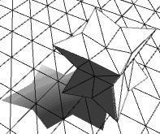

# Morphing 动画

**2016-6-20**

同一个模型，从一个形状变到另一个形状。如下图所示，从形状1渐变到形状2，再从形状2渐变到形状3，最后从形状3渐变到形状1，以此循环往复。

形状1 | 形状2 | 形状3
------------ | ------------- | ------------
 |  | 

由于这三个形状是由用一个模型衍生而来的（在建模软件中调整顶点位置），所以顶点数量完全相同，并且每个形状的顶点是一一对应的。那么要做到这个效果就很简单了，只需要在顶点之间做插值，将插值结果赋值给 mesh 的 vertex 即可。

关键的问题是，我们是在 CPU 中进行插值计算，后将数据提交到 GPU 中，还是直接在 Shader 中进行插值计算。在 CPU 中计算插值，坏处就是需要有一个动态的 VBO，每一帧都需要向 GPU 提交插值后的数据，当这个数据量很大的时候，消耗也是相当大的。如果可以在 GPU 中进行插值计算，就不会有这个问题，而且由于 GPU 是并行计算的，计算速度也要快很多（这是 CPU 无法比拟的）。那么问题来了，Unity 并没有提供自定义的数据流，做法是将原始顶点数据流和目标顶点数据流传到 Shader 中，在 Shader 中从两个数据流中提取数据，计算插值。所以这里采用一个取巧的办法，顶点数据中的 tangents 我并没有用到，把 tangents 当做一个数据流，将目标顶点数据赋值给 tangents，在 Shader 中对 tangent 和 vertex 进行插值，类似下面的代码。

	// 顶点坐标
	float4 vert = v.vertex;
	// v.tangent 中存储了目标顶点坐标值
	// 这里使用线性插值
	vert.xyz = vert.xyz + (v.tangent.xyz - vert.xyz) * _MorphingBlend;
	
这样插值的过程都是在 GPU 中完成了，只需要在插值的最后一帧的时候，修改下动态 VBO 即可，比完全在 CPU 中计算的消耗大大减少了。下图是测试效果。

