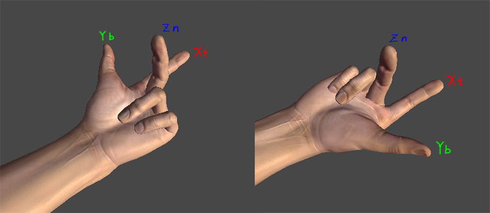

#法线贴图

**2016-4-16**

模型的光照效果是通过存储在顶点中的法线方向和光照角度计算得到的，当顶点数不多的时候，三角形上的法线方向是通过硬件插值得到的，由于硬件插值得到的是一个平滑的数值，这就造成了表面失去凹凸起伏的细节。法线贴图就是为了弥补这个而出现的，所以使用了法线贴图后，模型的法线方向可以细化到像素级别，而不是顶点级别。关于法线贴图的细节可以看[这篇文章](http://blog.csdn.net/candycat1992/article/details/41605257)，这里面已经讲得很清楚了。下面主要说一下在使用法线贴图时，如果模型的光照效果不正确，可能的一些检查点。

如果使用的是 Unity 内置的 Bump 类 Shader，那么第一个可以排除的就是 Shader 代码本身的问题。首先要检查的是模型本身的法线和切线是否正确，很多非技术类人员会很自然的认为有了法线贴图模型就不需要模型法线了，模型空间中的法线贴图确实是这样的，但是绝大多数的法线贴图都是切线空间中的，模型本身的法线和切线决定了切线空间，所以这一点是很重要的。至于如何检查，可以直接在 Maya 或者 3DMax 中打开模型，都会有命令来显示出法线，或者可以直接在 Unity 里检查（看[这里的方法](TBNDebug.html)）。然后要检查的就是法线贴图了，要明白的是法线贴图中每一个颜色通道表示的是什么，红、绿、蓝分别代表切线空间中的切线、副切线、法线，对于左手坐标系和右手坐标系来说，副切线的方向是相反的（看下图），这也就是为什么有的时候需要把法线纹理的绿色通道反转一下的原因了。

如果没有使用 Unity 内置的 Shader，而是自己实现，除了检查上述问题外，还需要仔细的检查下代码。其实使用法线贴图计算光照和使用模型法线计算光照的计算方法都是一样的，只是一个切线空间的区别，关于切线空间还是看上面提到的[那篇文章](http://blog.csdn.net/candycat1992/article/details/41605257)。在计算的时候要明确知道在哪个空间计算的光照，因为有的时候时候直接把 ViewDir、LightDir 转换到切线空间更合适，而有的时候把切线空间的法线转换到 WorldSpace 更合适（不管是自己写 VF Shader 还是 Unity 的 Surface Shader 都是如此）。

最后说明下 Shader 中计算付切线的代码：

	float3 binormal = cross( v.normal, v.tangent.xyz ) * v.tangent.w;
	
刚看到最后乘以的 v.tangent.w 会表示不解，不明白其意思。其实这就是上文中说的左右手坐标系的区别了。如果不想反转绿色通道，那么可以直接修改 `v.tangent.w`，当然为了统一和一致性是不建议这么做，只是作为一个小技巧。