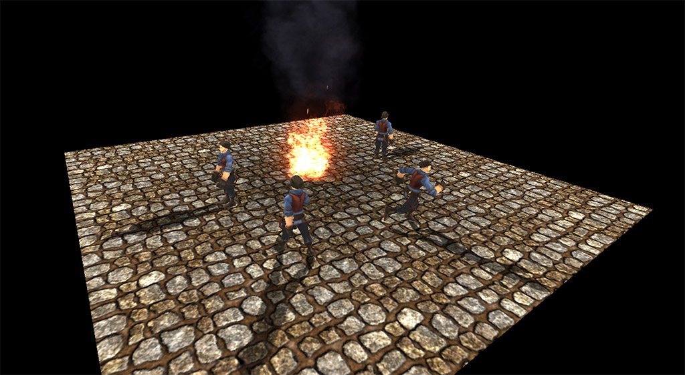
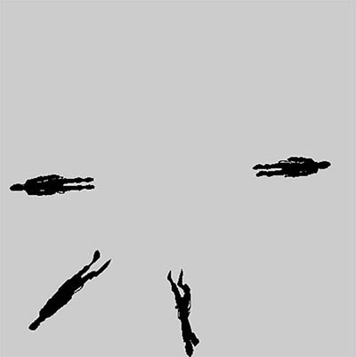
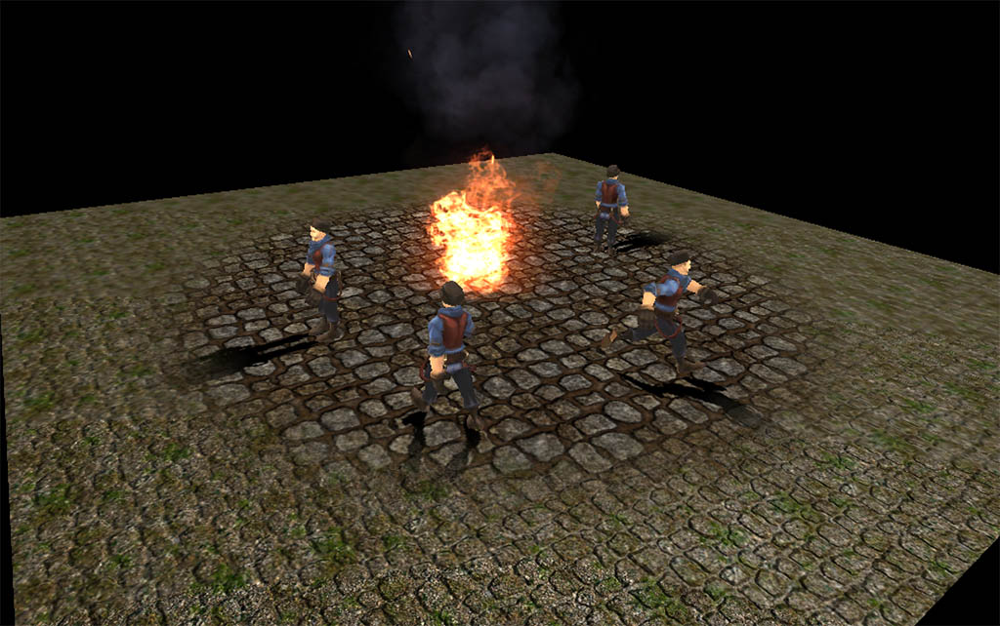

#点阴影

**2016-4-7**

在野外营地上有一堆篝火，当角色围着篝火走动的时候，角色的阴影应该以篝火为中心，呈放射状发散出去。这里就是要实现这个效果，能够在一定程度上提升场景的氛围。先看下效果图。

我去搜索了很多关于点阴影的资料，大多都都是使用 CubMap 实现 360 度无死角的点阴影，消耗很大自然不必说了。其实目前想要实现的效果并不需要适配所有情况，只需要上文中描述的需求即可。所以这里会使用自己的方法来实现点阴影的效果。消耗要尽可能的小，效果还要达到要求。小面就开始介绍解决方案。

首先使用最原始的平面阴影方法，将模型沿着光照的方向投射到地面（平面），然后使用虚拟摄像机将压扁的模型渲染到 RenderTexture，最后把 RenderTexture 叠加到地面上。既然是平面阴影，那就有一个缺陷，就是地面必须是一个平面，所以在制作场景的时候，篝火周围都会有一小块区域是平面（小幅的地面起伏是可以接受的，因为还不至于穿帮）。这就是主要的思路的，以下就开始介绍下每一步的具体细节。

第一步，将模型投射到地面上。这里使用到的方法是每个平面阴影的教程都会提到的，就是平面投射矩阵，这个矩阵的推导方法网上有很多，仔细搜索可以找到很多资料，这里直接列出我的代码。
	
	// 这段代码每个需要点阴影的角色都需要单独计算
    // N 表示的是平面（参考平面方程）。xyz是平面方向的向量，必须是归一化的。w表示沿着前面的xyz方向，从原点偏移多少距离。这里是测试场景，所以写了一个固定值。
    Vector4 N = new Vector4(0, 1, 0, 0);
    // 点光源光线的方向。
	Vector3 L = transform.position - center.position;
	L.Normalize();
	// 这里就是平面投影矩阵了
	Matrix4x4 mat = Matrix4x4.identity;
	mat.SetRow(0, new Vector4(N.y * L.y + N.z * L.z, -N.y * L.x, -N.z * L.x, -N.w * L.x));
	mat.SetRow(1, new Vector4(-N.x * L.y, N.x * L.x + N.z * L.z, -N.z * L.y, -N.w * L.y));
	mat.SetRow(2, new Vector4(-N.x * L.z, -N.y * L.z, N.x * L.x + N.y * L.y, -N.w * L.x));
	mat.SetRow(3, new Vector4(0, 0, 0, N.x * L.x + N.y * L.y + N.z * L.z));
    // 将矩阵传给模型的材质。注意模型本身是用不到这个矩阵的，是为了下一步渲染到 RenderTexture 做准备。
	renderer.material.SetMatrix("_PlanarMat", mat);
	
第二步，将平面阴影渲染到 RenderTexture。使用一个虚拟相机将平面阴影渲染到 RenderTexture 上。

	camera.target = renderTexture;
	// 先设置虚拟相机的置换 Shader，虚拟相机将会使用这个 Shader 来渲染它能看到的所有物体。
	// 我预先设置了虚拟相机的 CullingMask为 Role，也就是说虚拟相机只会渲染角色，没有地面等其它模型。
    camera.SetReplacementShader(Shader.Find("Custom/PlanarShadowToRT"), null);
    // 这里还有一步操作A，下面介绍。
    // 开始渲染
    camera.Render();

操作A做的事，是将要投射点阴影的面片调整为刚好完全撑满整个虚拟相机的拍摄范围，因为下一步中会把 RenderTexture 直接叠加到投射点阴影的面片上，如果不这样做，会看到阴影和模型对不上的操作。这步操作可以在运行时做，也可以直接在Editor中完成（不会有任何消耗）。当然不做这步也是可以的，那就必须像 ShadowMap 一样，反推出点在 RenderTexture 上的对应 UV（如果明白 ShadowMap 的原理的话，应该能理解这里描述的意思）。 为了避免这个麻烦，所以这里是这样实现的。

	// 虚拟相机是正交的，所以不需要考虑深度。
	Vector3 p0 = new Vector3(0, 0, camera.nearClipPlane);
	p0 = camera.ScreenToWorldPoint(p0);
	Vector3 p1 = new Vector3(camera.pixelWidth, camera.pixelHeight, camera.nearClipPlane);
	p1 = camera.ScreenToWorldPoint(p1);
	Vector3 scale = (p0 - p1);
	// 这里的plane是Unity内置的，默认1缩放时占世界空间的10个单位。
	// 将plane调整为刚好撑满整个虚拟相机拍摄的范围
	plane.localScale = new Vector3(Mathf.Abs(scale.x)/10.0f, 1, Mathf.Abs(scale.z) / 10.0f);

来看下 Custom/PlanarShadowToRT 这个 Shader 中的内容。

    // vertex
	v2f o;
	float4 v = i.vertex;
	// 需要变换到世界空间，因为平面投影矩阵是在世界空间处理的。
	v = mul(_Object2World, v);
	v.w = 1;
	// 将模型沿着光线方向投射到平面上
	v = mul(_PlanarMat, v);
	v.xyz /= v.w;
	v.w = 1;
	// 和以前一样的变换
	o.pos = mul(UNITY_MATRIX_VP, v);
	return o;
	
这一步完成后，我们看到的 RenderTexture 应该是这样的。

第三部，最后一步，将 RenderTexture 直接叠加到面片上。可以回看上文中给出的第一张图片，这就是叠加后的效果。至此基本就完成了，剩余的工作就是怎么将这个面片融合到 真正的地面中去，我使用了一个 Mask 纹理作为混合，来看下效果。使用 Mask 纹理，可以使用任意的形状来和地面混合，这就完全由美术根据需要了。

上面就是所有需要的步骤以及关键代码。由于是渲染到 RenderTexture 上，所以可以对 RenderTexture 做更多的处理，实现更多的效果。比如说可以让主光源的阴影和点光源的阴影同时显示。
