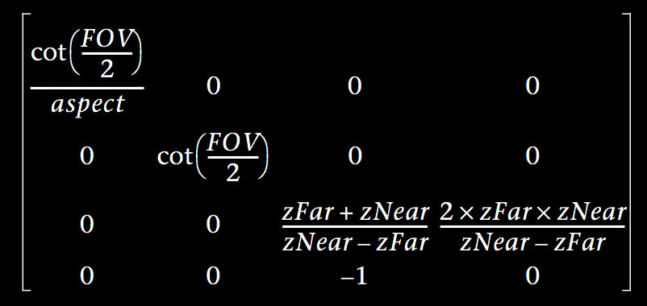
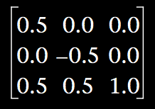

#纹理投射 Projective Texturing

**2016-3-10**

所谓纹理投射，是将坐标点投射到屏幕空间中的某个uv点，对屏幕空间中的纹理进行采样的技术。投射到的屏幕空间并不一定是当前正在渲染的屏幕空间，也可以是另一个虚拟的屏幕空间。

    pos = matrix_mvp * vertex
    screen_space_uv = pos.xy / pos.z * 0.5 + 0.5
    
具体是渲染到当前正在渲染的屏幕空间还是另一个虚拟的屏幕空间，区别就是 matrix_mvp 这个矩阵的差别了。当然上面的伪代码还有待改善，只是说明功能（[详见这里](ComputeScreenPos.html)）。

在 Unity 中可以很容易的从 Camera 中获取到这个 matrix_mvp 矩阵，可以是当前正在渲染的 Camera，或者是另一个虚拟的 Camera。但是如果不是 Unity 这种便利的引擎，那你就需要自己来构造 mvp 矩阵了。

Model 矩阵很容易，就是模型的 Transform（Rotation, Scale, Translate） 变换。

View 矩阵：

Projection 矩阵：

将 uv 映射到 0 到 1 的单位内：

最后将这几个矩阵连乘起来，就可以得到一个最终的矩阵。将这个矩阵在 vertex shader 里作用到模型的顶点坐标上，然后在 fragment shader 里使用 tex2Dproj 或者 tex2D （[详见这里](ComputeScreenPos.html)）对屏幕空间的纹理进行采样即可。