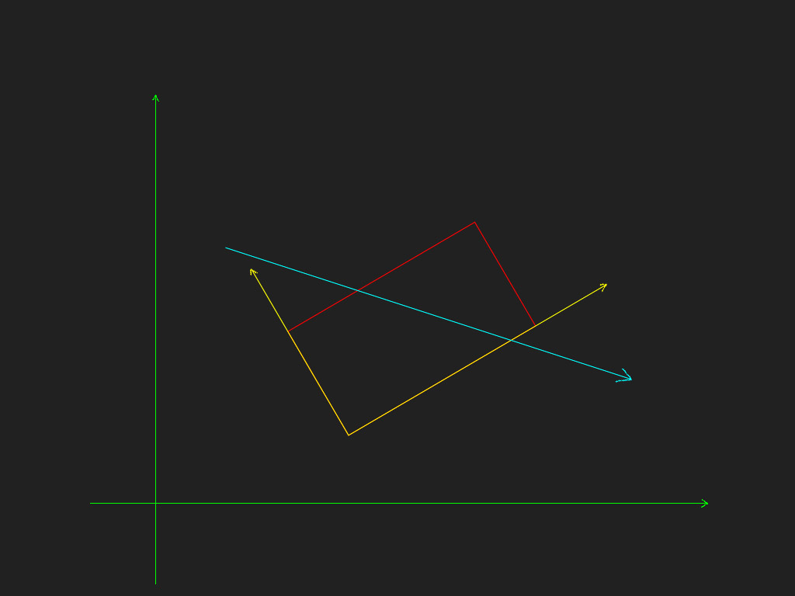
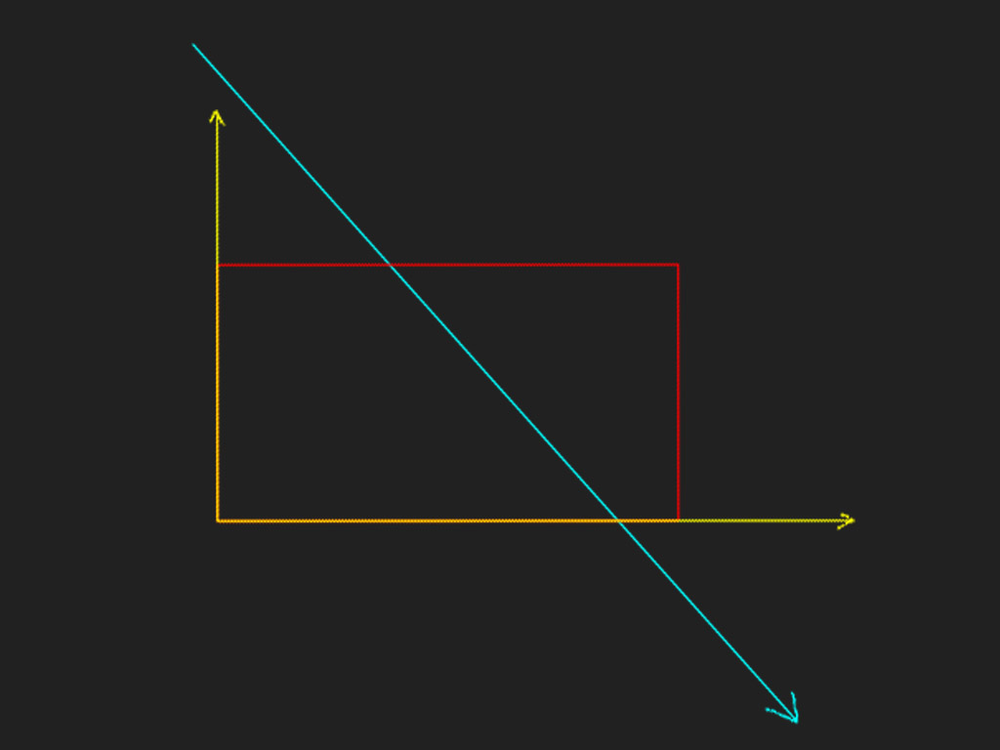
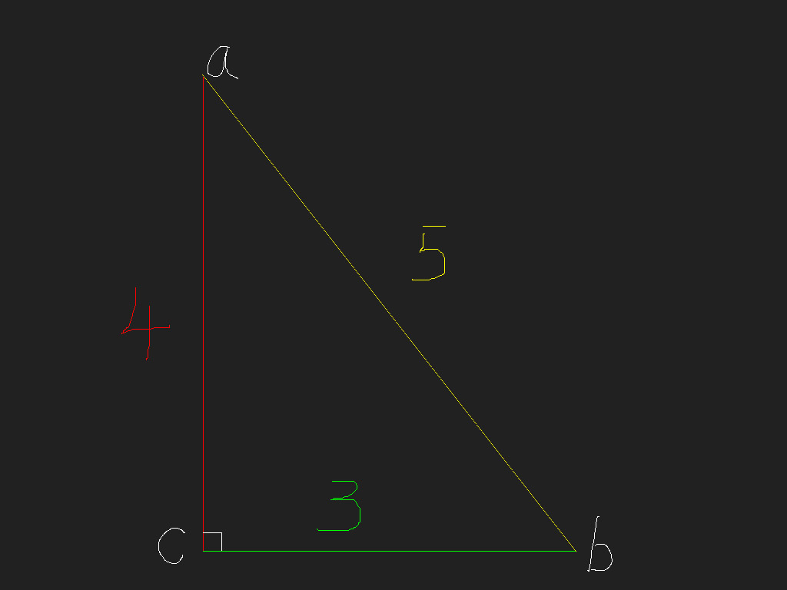

#矩形射线相交检测

**2016-3-8**

这里介绍一种检测射线和矩形相交的方法，方法的出处在[这里](http://www.cs.cornell.edu/courses/CS4620/2013fa/lectures/03raytracing1.pdf)，其中还介绍了其他形状的射线相交检测，由于我只需要用到矩形，所以只看矩形相关的，其他内容等空闲时间再看。

这种方法相当简洁快速，其中的一个特别之处就是整个计算过程所在的坐标系，不是矩形和射线所在的坐标系（下图的绿色坐标系），而是矩形内部的坐标系（下图的黄色坐标系）。所以需要把射线变换到矩形内部的坐标系下。

变换完成后，绿色坐标系就没有用了，所以可以直接去掉，为了看着更方便，我们将整体旋转到更舒适的角度。

好了，准备工作完成，下面先把原理解释清楚。

如上图所示，通过红色（已知）和绿色（已知）的边求出黄色（未知）的边。这个答案很明显，使用勾股定理能够很方便的求出。但是我们现在换一种方法，使用向量的思路来解决这个问题。已知单位向量ab，已知红色和绿色的边长，求黄色边长。注意这里说的单位向量ab，而不是向量ab。下面开始计算。

    黄色边长 = 绿色边长 / normalize(向量ab).x
    黄色边长 = 红色边长 / normalize(向量ab).y
    
对于上面的计算公式，如果你能够理解什么是单位向量以及向量分量的话，还是很好理解的。当然，因为答案是已知的，所以也可以直接把数字代入，以检验其正确性。值得注意的是，上面的两个公式任选其一就可以，都能够计算出我们想要的答案。也就是说我们只需要知道单位向量ab、红色边或者单位向量ab、绿色的边，就能够求出黄色的边。到这里为止，基础的原理已经讲解清楚了，下面开始将这个原理应用到矩形射线相交检测中。还记得上面准备好的示意图吗，在此基础上我们先把坐标轴去掉，以免干扰到辅助线，再加上一些标识。

首先我们在分析下这张图，已知，点 Pa(x,y)，射线 Dir，矩形最小点 Pmin（Xmin、Ymin），矩形最大点（Xmax、Ymax），求射线和矩形的是否相交，如果相交求出交点。

这里我们主要分析射线的起点不在矩形内部的情况，因为如果射线的起点在矩形内部，那么必然相交，交点的求法在下文中有讲解，所以这里直接跳过这种情况。

仔细观察图例，首先来求出点 Pxmin，这里我们把点 Pxmin 到点 Pa 之间的线段叫做 txmin，回看下上面个给出的公式，是不是可以求出 txmin 线段的长度呢。

    txmin = (Xmin - Pa.x) / Dir.x
    
同理求出点 Pymax 到点 Pa 之间线段的长度，tymax。

    tymax = (Ymax - Pa.y) / Dir.y 
    
同理求出点 Pymin 到点 Pa 之间线段的长度，tymin。

    tymin = (Ymin - Pa.y) / Dir.y

同理求出点 Pxmax 到点 Pa 之间线段的长度，txmax。

    txmax = (Xmax - Pa.x) / Dir.x
    
线段的长度有了，就可以求出点的具体位置了，比如求 Pxmin。这里只举例求出一个点，其他三个点的求法是一样的

    Pxmin = Pa + Dir * txmin
    
到这里还没结束，我们刚才求的是射线和 Xmin、Xmax、Ymin、Ymax四条直线的交点，但是这些交点是否落在矩形边上才是关键，才能确定射线和矩形是否有交点。通过仔细观看上面求出的 txmin、txmax、tymin、tymax这四个值，发现如果 txmin > tymax 或者 tymin > txmax，那么一定不相交，只要不出现这种情况就是相交（当然你需要先特殊处理下Dir和轴平行的情况）。

到此为止这种检测射线矩形相交的方法就介绍完了，具体在编写代码的时候还有一些细节需要处理，总体的思路就是这样。

