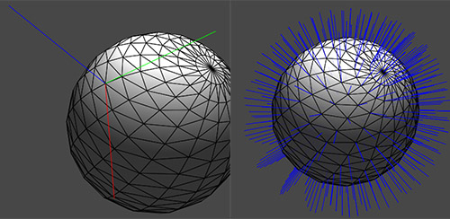

#显示切线空间

**2016-4-16**

有些情况下我想要把模型的切线空间显示出来，法线、切线、付切线、或者三者都显示。这样做主要是为了调试用，因为有的模型光照效果总是有问题，检查了 Shader 的计算后没有任何问题，最后定位到是模型本身的法线有问题，所以最快捷的方法就是直接在 Unity 中把法线显示出来。这样立即就能看到问题的所在了。

下面是关键的代码
	
	Vector3[] vertices = mesh.vertices;
	Matrix4x4 l2w = meshFilter.transform.localToWorldMatrix;
	Matrix4x4 l2w_v = l2w.inverse.transpose;
	DrawVectors(vertices, ref l2w, ref l2w_v, mesh.normals, Color.blue);
	
	private void DrawVectors(Vector3[] vertices, ref Matrix4x4 l2w, ref Matrix4x4 l2w_v, Vector3[] vectors, Color color)
	{
		Gizmos.color = color;
		int numVectors = vectors == null ? 0 : vectors.Length;
		for(int i = 0; i < numVectors; ++i)
		{
			Vector3 vector = vectors[i];
			Vector3 vertex = vertices[i];
			vertex = l2w.MultiplyPoint(vertex);
			vector = l2w_v.MultiplyVector(vector);
			vector.Normalize();
			Gizmos.DrawLine(vertex, vertex + vector * sizeTBN);
		}
	}

值得注意的是 `l2w_v`，为了在模型非统一缩放时也能正确显示，所以要这样使用，具体原因[看这里](NormalTransformation.html)。显示切线和付切线也是调用的 `DrawVectors` 函数，只是在调用前需要做点预处理。
	
	// 显示切线
	Vector4[] tangents = mesh.tangents;
	int numTangents = tangents == null ? 0 : tangents.Length;
	if(numTangents > 0)
	{
		Vector3[] newTangents = new Vector3[numTangents];
		for(int i = 0; i < numTangents; ++i)
		{
			Vector4 tangent = tangents[i];
			newTangents[i].x = tangent.x;
			newTangents[i].y = tangent.y;
			newTangents[i].z = tangent.z;
		}
		DrawVectors(vertices, ref l2w, ref l2w, newTangents, Color.red);
	}
	
	// 显示付切线
	Vector3[] normals = mesh.normals;
	Vector4[] tangents = mesh.tangents;
	int numTangents = tangents == null ? 0 : tangents.Length;
	if(numTangents > 0)
	{
		Vector3[] binTangents = new Vector3[numTangents];
		for(int i = 0; i < numTangents; ++i)
		{
			// 付切线是通过法线和切线计算得来的
			binTangents[i] = Vector3.Cross(normals[i], new Vector3(tangents[i].x, tangents[i].y, tangents[i].z)) * tangents[i].w;
		}
		DrawVectors(vertices, ref l2w, ref l2w, binTangents, Color.green);
	}
	
请注意上面代码调用 `DrawVectors` 传递的参数，原本应该传 `l2w_v` 的地方却传了 `l2w`，这是因为切线和付切线不会受非统一缩放的影响。
	