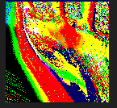
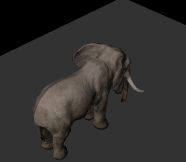
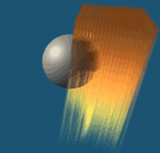

######使用 GPU 加速计算

**2016-9-?**

Unity 提供了 [Compute Shader][link1] 来使得我们可以将大量的复杂重复的计算交给并行的 GPU 来处理，正是由于并行原因，这样就可以大大加快计算的速度，相比在 CPU 的线程中有着巨大的优势。类似 OpenglES 3.0 的 [Transform Feedback][link2] 和 Metal 的 [Data-Parallel Compute Processing][link3] 都是用来达到同样的目的的。但是很遗憾 Compute Shader 基本和移动设备无缘了，而 Unity 也未能提供给开发者直接驾驭图形接口的能力，（[GL.IssuePluginEvent][link4] 似乎可以做到，但是这意味着需要自己处理很多跨平台跨设备的问题，感觉有点得不偿失）。在 [Unity Roadmap][link5] 中也未看到任何类似的迹象。

[link1]: https://docs.unity3d.com/Manual/ComputeShaders.html

[link2]: https://www.opengl.org/wiki/Transform_Feedback

[link3]: https://developer.apple.com/library/content/documentation/Miscellaneous/Conceptual/MetalProgrammingGuide/Compute-Ctx/Compute-Ctx.html#//apple_ref/doc/uid/TP40014221-CH6-SW1

[link4]: https://docs.unity3d.com/ScriptReference/GL.IssuePluginEvent.html

[link5]: https://unity3d.com/cn/unity/roadmap

于是乎一种曲线救国的方式就产生了，当然这里介绍的方法并不能替代 Compute Shader，只是某些特定情况下解决问题的方法，下面我们来仔细看这种方法的实现细节。

其实说来也简单，唯一要用到的就是 RenderTexture。我们可以在 fragment shader 中输出一个颜色值，这个颜色值就是我们经过一系列复杂计算得到的结果，而这些计算本来只能在 CPU 中进行，再通过某种方式（Texture、Mesh、Uniform Value）传给 GPU（这个传递的过程意味着一次 overhead，在移动设备上虽然没有硬件的物理因素，即使是内存共享也意味着内存的拷贝以及图形对象消耗），这个颜色值最终会被写入到相机所绑定的 RenderTexture 上，这样我们就得到了一张包含了很多数据的 RenderTexture，只是这些数据表现为颜色。然后将这张 RenderTexture 传给真正用来渲染的着色器，着色器从 RenderTexture 对应位置取出已经计算好的结果值，使用即可。

> 

这是一张尺寸为 128x128 的 RenderTexture，其中的每一个像素都存储着一个计算结果，且值会在每一帧中重新计算，这就形成了上图的效果。或许会有这样的疑问，为什么需要将结果存入 RenderTexture，而不是在 Shader 的需要用到的时候直接计算得到呢。这是因为如果是每次都在 Shader 中直接计算出新的结果，就必须有一个符合其数值变化规律的函数：

\\[\begin{align}
y &= f(x) \\\
&或 \\\
(x,y) &= f(t)
\end{align}\\]

不管自变量和结果如何，必须要找到函数 $$$ f() $$$。可是我们无法找到这个函数，因为渲染的结果是和场景有交互的，不可能一个公式搞定所有：

粒子碰撞 | 毛发模拟 
------------ | ------------- 
 |  

如果将顶点的计算放在 CPU 中处理，那么首先意味着会对 CPU 造成巨大的压力，其次计算完成后还要再发送到 GPU 中，这又是一次大消耗，显然是无法接受的。所以我们想到了是否能直接在 GPU 中计算，即加快了计算速度，又避免了传输数据的消耗。但又由于 Compute Shader 在移动平台的无效，所以就有了使用 RenderTexture 的这种方法。

大致的概念都说清楚了，下面来看一下实现的细节。也就是如何将数据编码到 RenderTexture 中的某个像素中，并且如何从对应的像素中读取数据。

首先当然是创建一个 RenderTexture：

	// C#
	// 这里使用的是 HALF_FLOAT 格式，因为我需要在这张 RenderTexture 中存储一个三维空间的坐标
	// 如果你不需要，可以设置为 RGB24 即可
	rt = new RenderTexture(rtSize, rtSize, 0, RenderTextureFormat.ARGBHalf);
	// 关闭 mipmap，使用点采样，这样纹理采样的时候不会受 filter 的影响
	rt.useMipMap = false;
	rt.generateMips = false;
	rt.filterMode = FilterMode.Point;
	rt.anisoLevel = 0;
	rt.wrapMode = TextureWrapMode.Clamp;
	rt.Create();

对创建的 RenderTexture 进行初始化：
	
	// C#
	// 新创建的 RenderTexture 中会包含显存中的垃圾数据，所以我们使用想要的数据对其初始化
	initTex = new Texture2D(rtSize, rtSize, TextureFormat.ARGB32, false);
	Color[] colors = initTex.GetPixels();
	int numColor = colors.Length;
	for (int i = 0; i < numColor; ++i)
	{
	    colors[i] = new Color(0, 0, 0);
	}
	initTex.SetPixels(colors);
	initTex.Apply();
	
	Graphics.Blit(initTex, positionsRT);
	
创建一个相机，用来向 RenderTexture 中填充数据：

	// C#
	GameObject camGo = new GameObject();
	camGo.hideFlags = HideFlags.HideAndDontSave;
	Camera cam = camGo.AddComponent<Camera>();
	// 相机默认处于关闭状态，我们会手动调用相机的渲染
	cam.enabled = false;
	// 相机的渲染目标为我们刚才创建的 RenderTexture
	cam.targetTexture = rt;
	// 不要让相机清除 RenderTexture 上数据，因为每一帧的数据对于下一帧都是有意义的
	cam.clearFlags = CameraClearFlags.Nothing;
	// 这个相机不需要渲染所有的东西，只渲染我们需要即可
	cam.cullingMask = LayerMask.GetMask("MyCullingLayer");

当然要向 RenderTexture 中渲染些东西，并不一定要通过相机：

	// C#
	// 使用这种方式也是可以的，消耗要比使用相机渲染小一点
	// 两种方法根据需要进行选择
	RenderTexture.active = rt;
	Graphics.DrawMeshNow
	
这里就要开始创建需要渲染 Mesh 了，Mesh 中的每个顶点上的数据都是非常关键的，我们会通过程序代码来创建 Mesh 而不是建模软件，因为顶点中的数据都有其独特的意义，比如说 normal 属性里存储的并不是真正的法线信息，而是我们自己需要的数据。当然如果 Mesh 中每个顶点属性中存储的数据类型完全确定好之后，在 Unity 中实现一个笔刷来让美术刷出这些数据也就并非是难事，这是后话先不说了。

	// C#
	List<Vector3> vertices = new List<Vector3>();
	List<Color> colors = new List<Color>();
	List<Vector2> uv = new List<Vector2>();
	List<Vector4> tangents = new List<Vector4>();
	List<int> triangles = new List<int>();

	// 这里开始填充顶点数据
	// 具体填充什么数据呢，这个根据要渲染成什么模型有关，每个人都会做出不同的选择
	// 比如我们上文中的两个 Demo，一个是粒子碰撞，一个是毛发模拟，这两个 Demo 中在 Mesh 中填充的数据都不一样
	// 所以这里暂时跳过，但是通过下面的说明，应该会让我们更清楚这里需要什么数据

	mesh = new Mesh();
	mesh.vertices = vertices.ToArray();
	mesh.colors = colors.ToArray();
	mesh.uv = uv.ToArray();
	mesh.tangents = tangents.ToArray();
	mesh.triangles = triangles.ToArray();
	// 设定新的包围盒很重要，相机的视锥体裁切都靠它了，我偷了个懒，直接设置为一个很大的包围盒，实际情况需要根据模型的大小来设置
	mesh.bounds = new Bounds(Vector3.zero, new Vector3(9999, 9999, 9999));
	
在应用程序中所有需要的东西都创建好了，下面开始渲染：

	// C#
	// 这是 MainCamera 的回调，在 MainCamera 渲染之前，Unity 会自动回调这个函数
	void OnPreRender()
	{
		// 上文说过，要渲染一个模型（向 RenderTexture 填充数据）有两种方法
		// 方法1
		// cam 是上文中有代码创建的相机
		// rt 是上文中用代码创建的 RenderTexture
		cam.targetTexture = rt;
		cam.RenderWithShader(Shader.Find("FillRenderTextureShader"), null);
		// 方法2
		if(mat == null)
		{
			mat = new Material(Shader.Find("FillRenderTextureShader"));
		}
		RenderTexture oldRT = RenderTexture.active;
		RenderTexture.active = rt;
		mat.SetPass(0);
		Graphics.DrawMeshNow(mesh, Matrix.Identify); // 这里的矩阵，因为我们在 Shader 中并没有用到，所以直接设置为单位（任意）矩阵
		RenderTexture.active = oldRT;
	}

至此，所有必要的准备都已经完成，然后就是 Shader，前面所做的一切都是为一步在做准备：

	// FillRenderTextureShader
	// vertex shader 
	v2f vert(appdata v)
	{
		// o.vertex 直接决定了将当前 fragment 输出到 RenderTexture 上的哪个像素中
		// o.vertex.xy 经过投影变换后的值都是在 -1 到 1 之间
		//             我们需要知道当前应该输出到 [-1,1] 之间的哪个值上，这就需要在上文中创建 Mesh 时填充顶点数据时指定好，这里直接读取即可
		// o.vertex.z 这个值我们其实用不到，但是不能随便设置，因为 OpenGL 是 [-1,1]，而 DirectX 是 [0,1]，
		//            超出这个范围会被裁切掉，所以我们要同时兼顾到，设置为 0
		// o.vertex.w 这是用来做齐次坐标变换的，将顶点转换到 Canonical View Volume。简单来说最终的会将 xy 除以 w，来转换到齐次裁剪空间坐标系，
		//            但是我们不希望进行这个操作，所以设置为 1
		o.vertex = ......;
		
		// 这是用来解决平台差异的
		// 因为 OpenGL 的纹理坐标 (0,0) 点在左下角，而 DirectX 的纹理坐标 (0,0) 点在左上角
		#if UNITY_UV_STARTS_AT_TOP
		float scale = -1.0;
		#else
		float scale = 1.0;
		#endif
		o.vertex.y *= scale;
		
		// 在这里进行一系列的计算，将计算结果存放到 color 中
		i.color = ......
	}
	
	float4 frag(v2f i) : SV_Target
	{
		return i.color;
	}
	
数据填充好后，如何在 MainCamera 渲染模型的时候将顶点对应的数据从 RenderTexture 中取出来呢，这就非常简答了：

	// Shader
	// uv 也是在创建 Mesh 的时候就已经指定好了，直接从顶点数据中拿来用即可
	tex2D(_RenderTexture, uv);
	
以上就是要用到的所有关键代码和主要思路了。粒子碰撞和毛发模拟就是使用的这种方式实现的，让并行的 GPU 进行了大量的计算，使得 CPU 为零消耗，而 GPU 也只发挥了大概 25% 不到的能力，也就是说 GPU 还能处理很多其他的事情。FPS 也达到了满帧。 以上数据是在 Instruments 的 GPU Driver 中查看的，使用的测试设备是 Iphone6S。并且在 Metal、OpenGLES3.0、OpenGLES2.0 这三个 Graphics API 下都表现正常。注意实际开发时需要在更多设备上进行测试，并且做好设备不支持时的备选方案。

最后说一个容易被忽视的细节，而这个细节有可能会导致最终出现我们不想要的结果。使用以上方法就意味着对于一张 RenderTexture 的 Texel，同时既从中读取数据又向其写入数据，根据我的理解，这就是 [Sampling and Rendering to the Same Texture][link6] 和 [Feedback Loops][link7] 所指的情况。而我的测试中并没有遇到过，所以先忽略的，可能是测试设备使用了类似文中所提到的 texture_barrier 技术。当然如果真的出现了这种情况也是有方法解决的，我们可以使用两张 RenderTexture 交替使用，在第一帧中从 A 读取，写入 B，第二帧中从 B 读取写入 A，类似双缓冲一样就能解决这个问题了。

[link6]: https://www.opengl.org/wiki/GLSL_:_common_mistakes

[link7]: https://www.opengl.org/wiki/Framebuffer_Object#Feedback_Loops